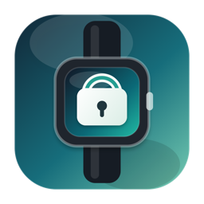
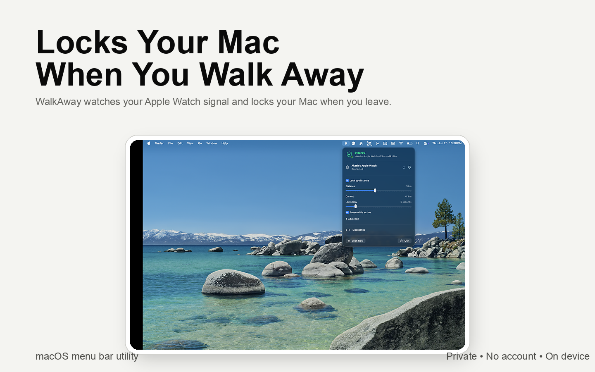
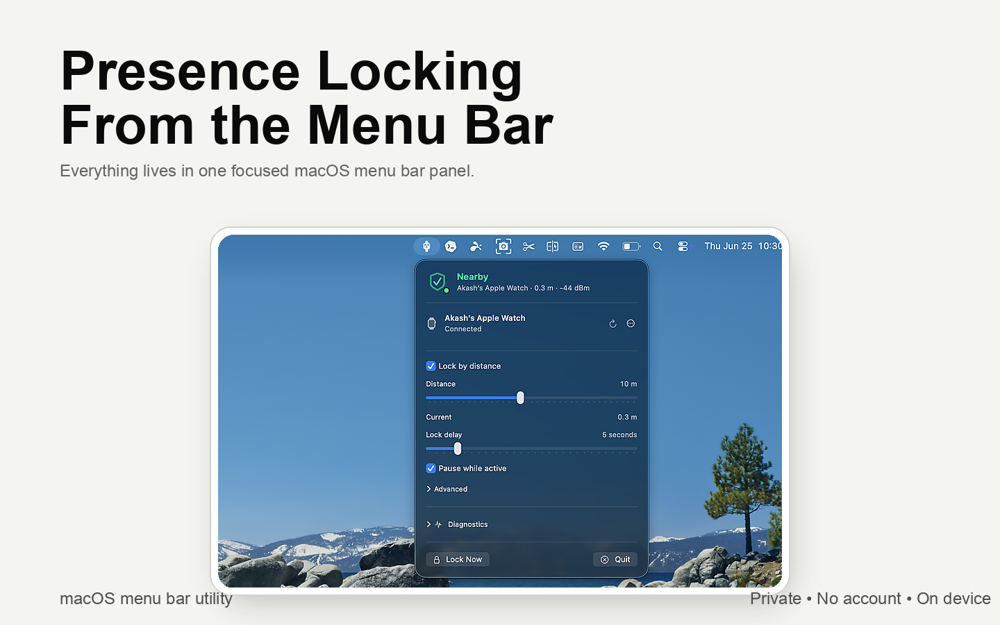

  

<h1 align="center">WalkAway</h1>

  <b>Walk away. Your Mac locks. Come back. Keep working.</b>

  Your Mac locks itself the moment you step away with your Apple Watch — 
  and stays open while you're sitting right there.

  
  
  
  

  <a href="https://github.com/antivirusakash/WalkAway/releases/latest"><b>⬇️  Download for Mac</b></a>

  

---

## Get started in a minute

1. **[Download the latest release](https://github.com/antivirusakash/WalkAway/releases/latest)** and open the `.dmg`.
2. Drag **WalkAway** into your **Applications** folder.
3. Open it, allow **Bluetooth**, and pick your **Apple Watch**.

That's it. Walk away — your Mac locks. Come back — it's right where you left it.

> Signed and **notarized by Apple**, so it opens normally — no scary warnings.

## Why you'll like it

- 🔒 **Locks when you leave.** No idle timer waiting to expire — it locks on *you* being gone.
- ⌨️ **Never locks mid-task.** While you're typing or moving the mouse, it waits.
- 📏 **You pick the distance.** Default 6 meters, adjustable from 2 to 20.
- 🔋 **Quiet and light.** Lives in your menu bar and launches at login.
- 🔐 **Totally private.** No account, no cloud, no tracking. Nothing ever leaves your Mac.

  

## Good to know

WalkAway only **locks** your Mac — it never unlocks, sleeps, or wakes it, and
never touches your running apps. Long tasks keep running behind the lock screen.
Unlocking stays with macOS: password, Touch ID, or your Apple Watch.

## FAQ

**Do I need anything besides my Mac?**
An Apple Watch on the same Apple ID, with Bluetooth on. That's it.

**Will it lock while I'm still working?**
No — it holds off while you're actively using the Mac, and only locks once
you've truly stepped away.

**Is it on the Mac App Store?**
No. WalkAway is downloaded directly here (signed and notarized by Apple). macOS
doesn't allow App Store apps to lock the screen, so it ships as a direct download.

**Does it send my data anywhere?**
Never. It only reads the Bluetooth signal strength of the watch you choose, on
your Mac. See the [Privacy Policy](PRIVACY.md).

---

  Made by Fizday · Tweak every setting in the <a href="docs/USAGE.md">Settings &amp; Usage guide</a> · <a href="PRIVACY.md">Privacy</a>

